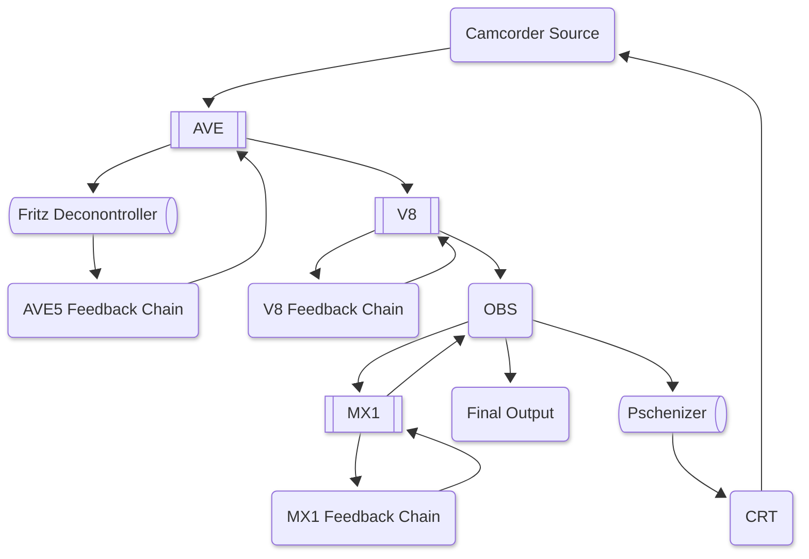

	<picture title='gongo'>
		
	</picture>
	 
	

### Visuals

| Name                                                        |                                                                Description                                                                |                                                                                                                                                                                      Links &nbsp;&nbsp;&nbsp;&nbsp;&nbsp;&nbsp;&nbsp;&nbsp;&nbsp;&nbsp;&nbsp;&nbsp;&nbsp;&nbsp;&nbsp;&nbsp;&nbsp;&nbsp;&nbsp;&nbsp;&nbsp;&nbsp;&nbsp;&nbsp;&nbsp;&nbsp; Platforms                                                                                                                                                                                       |                                                                Price                                                                |                                   License                                    |
| :---------------------------------------------------------- | :---------------------------------------------------------------------------------------------------------------------------------------: | :---------------------------------------------------------------------------------------------------------------------------------------------------------------------------------------------------------------------------------------------------------------------------------------------------------------------------------------------------------------------------------------------------------------------------------------------------------------------------------------------------------------------------------------------------------------: | :---------------------------------------------------------------------------------------------------------------------------------: | :--------------------------------------------------------------------------: |
| [Blender](https://www.blender.org)                          |                                                             3D creation suite                                                             |                                                  [<picture title='GitHub'><source srcset='./images/gh.png' media='(prefers-color-scheme: dark)'></picture>](https://github.com/blender/blender) [![steam]](https://store.steampowered.com/app/365670/Blender)   <picture title='Mac'><source srcset='./images/mac.png' media='(prefers-color-scheme: dark)'></picture> <picture title='Windows'></picture>                                                  |                                                                Free                                                                 |                               GPL-3.0-or-later                               |
| [Cathodemer](https://www.hypertonal.net/cathodemer)         |                                          pixel-based video synthesizer and CRT display simulator                                          |                                                                                                      [![steam]](https://store.steampowered.com/app/697860/Cathodemer)   <picture title='Linux'></picture> <picture title='Mac'><source srcset='./images/mac.png' media='(prefers-color-scheme: dark)'></picture> <picture title='Windows'></picture>                                                                                                       |                                            [$25](https://steamdb.info/app/697860#prices)                                            |                                 Proprietery                                  |
| [Chataigne](https://benjamin.kuperberg.fr/chataigne)        |                                          artist-friendly modular machine for art and technology                                           |                                              [<picture title='GitHub'><source srcset='./images/gh.png' media='(prefers-color-scheme: dark)'></picture>](https://github.com/benkuper/Chataigne)   <picture title='Linux'></picture> <picture title='Mac'><source srcset='./images/mac.png' media='(prefers-color-scheme: dark)'></picture> <picture title='Windows'></picture>                                               |                                                                Free                                                                 |                               GPL-3.0-or-later                               |
| [Datamosh 2](https://aescripts.com/datamosh)                |                                                data moshing plugin for Adobe After Effects                                                |                                                                                                                                                                           <picture title='Mac'><source srcset='./images/mac.png' media='(prefers-color-scheme: dark)'></picture> <picture title='Windows'></picture>                                                                                                                                                                            |                                                                 $60                                                                 |  [Proprietery](https://aescripts.com/faq/article/view/faq/license-code-faq)  |
| [GifSlap](https://gifslap.com)                              |                                                   vj software for people who love gifs                                                    |                                                                                [<picture title='GitHub'><source srcset='./images/gh.png' media='(prefers-color-scheme: dark)'></picture>](https://github.com/gridwalk/gifSlap)   <picture title='Mac'><source srcset='./images/mac.png' media='(prefers-color-scheme: dark)'></picture> <picture title='Windows'></picture>                                                                                 |                                                                Free                                                                 |                               Source Available                               |
| [Hydra](https://hydra.ojack.xyz)                            |                                                livecoding networked visuals in the browser                                                |                                                                                                                                                                [<picture title='GitHub'><source srcset='./images/gh.png' media='(prefers-color-scheme: dark)'></picture>](https://github.com/hydra-synth/hydra)[![npm]](https://www.npmjs.com/package/hydra-synth)                                                                                                                                                                 |                                                                Free                                                                 |                              AGPL-3.0-or-later                               |
| [JWildfire](https://jwildfire.overwhale.com)                |                                     powerful, flexible and user-friendly static fractal flame editor                                      |              [<picture title='GitHub'><source srcset='./images/gh.png' media='(prefers-color-scheme: dark)'></picture>](https://github.com/thargor6/JWildfire) [![steam]](https://store.steampowered.com/app/1445310/JWildfire)   <picture title='Linux'></picture> <picture title='Mac'><source srcset='./images/mac.png' media='(prefers-color-scheme: dark)'></picture> <picture title='Windows'></picture>              |                                        Free / [$12](https://steamdb.info/app/1445310#prices)                                        |                              LGPL-2.1-or-later                               |
| [JWildfireSwan](https://jwildfire-swan.overwhale.com)       |                                            sequel to JWildfire that supports animated fractals                                            |         [<picture title='GitHub'><source srcset='./images/gh.png' media='(prefers-color-scheme: dark)'></picture>](https://github.com/bradparks/JWildfireSwan) [![steam]](https://store.steampowered.com/app/3529700/JWildfireSwan)   <picture title='Linux'></picture> <picture title='Mac'><source srcset='./images/mac.png' media='(prefers-color-scheme: dark)'></picture> <picture title='Windows'></picture>          |                                        Free / [$25](https://steamdb.info/app/3529700#prices)                                        |                              LGPL-2.1-or-later                               |
| [Magic Music Visuals](https://magicmusicvisuals.com)        |                                    modular interface to create interactive animation and video effects                                    |                                                                                                                                                                           <picture title='Mac'><source srcset='./images/mac.png' media='(prefers-color-scheme: dark)'></picture> <picture title='Windows'></picture>                                                                                                                                                                            |                                            [$80](https://magicmusicvisuals.com/purchase)                                            |                                 Proprietery                                  |
| [Milkdrop 3](https://milkdrop3.com)                         |                                        audio visualizer based on MilkDrop with additional features                                        |                                                                                                              [<picture title='GitHub'><source srcset='./images/gh.png' media='(prefers-color-scheme: dark)'></picture>](https://github.com/milkdrop2077/MilkDrop3)   [![linux]](github.com/milkdrop2077/MilkDrop3/tree/main/linux#readme) <picture title='Windows'></picture>                                                                                                               |                                    [$10/$50](https://milkdrop3.com/#:~:text=Upgrade%20MilkDrop)                                     |                               Source Available                               |
| [Mosh-Pro](https://moshpro.app)                             |                                                    real-time effects for image + video                                                    |                                                                                                                                                                           <picture title='Mac'><source srcset='./images/mac.png' media='(prefers-color-scheme: dark)'></picture> <picture title='Windows'></picture>                                                                                                                                                                            |                                           [$50 / $25/year](https://moshpro.app/#pricing)                                            |                                 Proprietery                                  |
| [ntsc-rs](https://ntsc.rs)                                  |                                          nostalgia of VHS from the comfort of your home computer                                          |                                                [<picture title='GitHub'><source srcset='./images/gh.png' media='(prefers-color-scheme: dark)'></picture>](https://github.com/ntsc-rs/ntsc-rs)   <picture title='Linux'></picture> <picture title='Mac'><source srcset='./images/mac.png' media='(prefers-color-scheme: dark)'></picture> <picture title='Windows'></picture>                                                |                                                                Free                                                                 |                                     MIT                                      |
| [Nuvotion Visuals](https://nuvotion.live)                   |                                          powerful free tool for creating audio-reactive visuals                                           |                                                                                                                                                                                                                                               <picture title='Windows'></picture>                                                                                                                                                                                                                                               |                                                                Free                                                                 | [Proprietery](https://nuvotion.live/terms-of-service#limited-license-to-use) |
| [ORCΛ](https://100r.co/site/orca.html)                      |                                                       esoteric programming language                                                       |                                                  [<picture title='GitHub'><source srcset='./images/gh.png' media='(prefers-color-scheme: dark)'></picture>](https://github.com/tixl3d/tixl)   <picture title='Linux'></picture> <picture title='Mac'><source srcset='./images/mac.png' media='(prefers-color-scheme: dark)'></picture> <picture title='Windows'></picture>                                                  |                                                                Free                                                                 |                                     MIT                                      |
| [Ossia Score](https://ossia.io)                             |                                               interactive sequencer for the intermedia arts                                               |                                                                                                                     [<picture title='GitHub'><source srcset='./images/gh.png' media='(prefers-color-scheme: dark)'></picture>](https://github.com/ossia/score)   <picture title='Linux'></picture>  <picture title='Windows'></picture>                                                                                                                     |                                                                Free                                                                 |                               GPL-3.0-or-later                               |
| [PHYSARUM](https://store.steampowered.com/app/1667120)      |                                                           slime mold simulator                                                            |                                                                                                                                                                                                                                       [![steam]](https://store.steampowered.com/app/1667120/PHYSARUM_Slime_Mold_Simulator)                                                                                                                                                                                                                                        |                                            [$6](https://steamdb.info/app/1667120#prices)                                            |                                 Proprietery                                  |
| [PraxisLIVE](https://www.praxislive.org)                    |                                                    hybrid visual live programming IDE                                                     |                                                                                                                                                                                       [<picture title='GitHub'><source srcset='./images/gh.png' media='(prefers-color-scheme: dark)'></picture>](https://github.com/praxis-live/praxis-live)                                                                                                                                                                                       |                                                                Free                                                                 |                               GPL-3.0-or-later                               |
| [projectM](https://en.wikipedia.org/wiki/MilkDrop#projectM) |                                      cross-platform, open-source audio visualizer based on MilkDrop                                       | [<picture title='GitHub'><source srcset='./images/gh.png' media='(prefers-color-scheme: dark)'></picture>](https://github.com/projectM-visualizer/projectm) [![steam]](https://store.steampowered.com/app/1358800/projectM_Music_Visualizer)   <picture title='Linux'></picture> <picture title='Mac'><source srcset='./images/mac.png' media='(prefers-color-scheme: dark)'></picture> <picture title='Windows'></picture> |                                                                Free                                                                 |                              LGPL-2.1-or-later                               |
| [Radiance](https://radiance.video)                          |                                     video art software designed for live performance, written in Rust                                     |                                                                                                                                                      [<picture title='GitHub'><source srcset='./images/gh.png' media='(prefers-color-scheme: dark)'></picture>](https://github.com/zbanks/radiance)   <picture title='Linux'></picture>                                                                                                                                                       |                                                                Free                                                                 |                                     MIT                                      |
| [Resolume](https://www.resolume.com)                        |                                                       media server and vj software                                                        |                                                                                                                                                                           <picture title='Mac'><source srcset='./images/mac.png' media='(prefers-color-scheme: dark)'></picture> <picture title='Windows'></picture>                                                                                                                                                                            |                                              [€300-800](https://www.resolume.com/shop)                                              |                                 Proprietery                                  |
| [ShaderGlass](https://github.com/mausimus/ShaderGlass)      |                                             overlay for running GPU shaders on top of Windows                                             |                                                                                                                [<picture title='GitHub'><source srcset='./images/gh.png' media='(prefers-color-scheme: dark)'></picture>](https://github.com/mausimus/ShaderGlass) [![steam]](https://store.steampowered.com/app/3613770/ShaderGlass)   <picture title='Windows'></picture>                                                                                                                 |                                                                Free                                                                 |                               GPL-3.0-or-later                               |
| [Synesthesia](https://synesthesia.live)                     |                                audio-reactive visual instrument used by vjs, musicians and creative coders                                |                                                                                                                                                                           <picture title='Mac'><source srcset='./images/mac.png' media='(prefers-color-scheme: dark)'></picture> <picture title='Windows'></picture>                                                                                                                                                                            |                                            [$200/$400](https://synesthesia.live/pricing)                                            |                                 Proprietery                                  |
| [TiXL](https://tixl.app)                                    |                                                           the sequel to Tooll3                                                            |                                                                                                                                                [<picture title='GitHub'><source srcset='./images/gh.png' media='(prefers-color-scheme: dark)'></picture>](https://github.com/tixl3d/tixl)   [![linux]](https://vjun.io/vdmo/how-to-install-tooll3-on-linux-or-other-apps-30f5)                                                                                                                                                |                                                                Free                                                                 |                               GPL-3.0-or-later                               |
| [TouchDesigner](https://derivative.ca)                      |                                                  node-based visual programming language                                                   |                                                                                                                                                                           <picture title='Mac'><source srcset='./images/mac.png' media='(prefers-color-scheme: dark)'></picture> <picture title='Windows'></picture>                                                                                                                                                                            | [Free](https://derivative.ca/product/touchdesigner-non-commercial) / [$600](https://derivative.ca/product/touchdesigner-commercial) |                                 Proprietery                                  |
| [vimix](https://brunoherbelin.github.io/vimix)              | performs graphical mixing and blending of several movie clips and computer generated graphics, with image processing effects in real-time |                                                                                 [<picture title='GitHub'><source srcset='./images/gh.png' media='(prefers-color-scheme: dark)'></picture>](https://github.com/brunoherbelin/vimix)   <picture title='Linux'></picture> <picture title='Mac'><source srcset='./images/mac.png' media='(prefers-color-scheme: dark)'></picture>                                                                                 |                                                                Free                                                                 |                               GPL-3.0-or-later                               |
| [Web Shaders](https://shaders.com)                          |                                                 shader magic for frontend web frameworks                                                  |                                                                                                                                                                                                                                                              [![npm]](www.npmjs.com/package/shaders)                                                                                                                                                                                                                                                              |                                                                $250                                                                 |                      [Proprietery](shaders.com/license)                      |

### Audio

| Name                                  |                     Description                     |                                                                                                                                          Links &nbsp;&nbsp;&nbsp;&nbsp;&nbsp;&nbsp;&nbsp;&nbsp;&nbsp;&nbsp;&nbsp;&nbsp;&nbsp;&nbsp;&nbsp;&nbsp;&nbsp;&nbsp;&nbsp;&nbsp;&nbsp;&nbsp;&nbsp;&nbsp;&nbsp;&nbsp; Platforms                                                                                                                                           |                    Price                    |     License      |
| :------------------------------------ | :-------------------------------------------------: | :-----------------------------------------------------------------------------------------------------------------------------------------------------------------------------------------------------------------------------------------------------------------------------------------------------------------------------------------------------------------------------------------------------------------------------------------------------------------------: | :-----------------------------------------: | :--------------: |
| [MiniMeters](https://minimeters.app)  |      audio metering application & plugin suite      |                                                                                              <picture title='Linux'></picture> <picture title='Mac'><source srcset='./images/mac.png' media='(prefers-color-scheme: dark)'></picture> <picture title='Windows'></picture>                                                                                               |                     $20                     |   Proprietery    |
| [Tenacity](https://tenacityaudio.org) | multi-track audio editor/recorder based on Audacity | [<picture title='GitHub'><source srcset='./images/gh.png' media='(prefers-color-scheme: dark)'></picture>](https://github.com/tenacityteam/tenacity)   <picture title='Linux'></picture> <picture title='Mac'><source srcset='./images/mac.png' media='(prefers-color-scheme: dark)'></picture> <picture title='Windows'></picture> |                    Free                     |   GPL-2.0-only   |
| [VCV Rack](https://vcvrack.com)       |            software modular synthesizer             |     [<picture title='GitHub'><source srcset='./images/gh.png' media='(prefers-color-scheme: dark)'></picture>](https://github.com/VCVRack/Rack)   <picture title='Linux'></picture> <picture title='Mac'><source srcset='./images/mac.png' media='(prefers-color-scheme: dark)'></picture> <picture title='Windows'></picture>      | [Free / $150](https://vcvrack.com/Rack#get) | GPL-3.0-or-later |
<!-- haven't decided whether or not to include games
| [Ynglet](https://www.akuparagames.com/game/ynglet) | platformer with no platforms and a dynamic, reactive soundtrack |                                                                                                                                                                                                       [![steam]](https://store.steampowered.com/app/1015920/Ynglet)                                                                                                                                                                                                       | [$8](https://steamdb.info/app/1015920#prices) |   Proprietery    |
-->

### Players

| Name                                    |                    Description                    |                                                                                                                                       Links &nbsp;&nbsp;&nbsp;&nbsp;&nbsp;&nbsp;&nbsp;&nbsp;&nbsp;&nbsp;&nbsp;&nbsp;&nbsp;&nbsp;&nbsp;&nbsp;&nbsp;&nbsp;&nbsp;&nbsp;&nbsp;&nbsp;&nbsp;&nbsp;&nbsp;&nbsp; Platforms                                                                                                                                       | Price |      License      |
| :-------------------------------------- | :-----------------------------------------------: | :----------------------------------------------------------------------------------------------------------------------------------------------------------------------------------------------------------------------------------------------------------------------------------------------------------------------------------------------------------------------------------------------------------------------------------------------------------------: | :---: | :---------------: |
| [foobar2k](https://www.foobar2000.org)  |         an advanced freeware audio player         |                                                                                                                            <picture title='Mac'><source srcset='./images/mac.png' media='(prefers-color-scheme: dark)'></picture> <picture title='Windows'></picture>                                                                                                                            | Free  |    Proprietery    |
| [mpv](https://mpv.io)                   | reliable media player that can do almost anything | [<picture title='GitHub'><source srcset='./images/gh.png' media='(prefers-color-scheme: dark)'></picture>](https://github.com/mpv-player/mpv)   <picture title='Linux'></picture> <picture title='Mac'><source srcset='./images/mac.png' media='(prefers-color-scheme: dark)'></picture> <picture title='Windows'></picture> | Free  | LGPL-2.1-or-later |
| [Potplayer](https://potplayer.daum.net) |            tried-and-true gongo player            |                                                                                                                                                                                               <picture title='Windows'></picture>                                                                                                                                                                                                | Free  |    Proprietery    |
| [WACUP](https://getwacup.com)           |                    neo winamp                     |                                                                                                                                                                                               <picture title='Windows'></picture>                                                                                                                                                                                                | Free  |    Proprietery    |

### Gaming

| Name                                                |                      Description                      |                                                                    Links &nbsp;&nbsp;&nbsp;&nbsp;&nbsp;&nbsp;&nbsp;&nbsp;&nbsp;&nbsp;&nbsp;&nbsp;&nbsp;&nbsp;&nbsp;&nbsp;&nbsp;&nbsp;&nbsp;&nbsp;&nbsp;&nbsp;&nbsp;&nbsp;&nbsp;&nbsp; Platforms                                                                    | Price |   License    |
| :-------------------------------------------------- | :---------------------------------------------------: | :--------------------------------------------------------------------------------------------------------------------------------------------------------------------------------------------------------------------------------------------------------------------------------------------------------------------------: | :---: | :----------: |
| [ReShade](https://reshade.me)                       | post-processing injector for games and video software | [<picture title='GitHub'><source srcset='./images/gh.png' media='(prefers-color-scheme: dark)'></picture>](https://github.com/crosire/reshade)   [![linux]](https://github.com/kevinlekiller/reshade-steam-proton) <picture title='Windows'></picture> | Free  | BSD-3-Clause |
| [vkBasalt](https://github.com/DadSchoorse/vkBasalt) |        vulkan post-processing layer for linux         |                                 [<picture title='GitHub'><source srcset='./images/gh.png' media='(prefers-color-scheme: dark)'></picture>](https://github.com/DadSchoorse/vkBasalt)   <picture title='Linux'></picture>                                  | Free  |     Zlib     |

### Streaming

| Name                                                                                                                             |                                    Description                                     |                                                                                                                                                 Links &nbsp;&nbsp;&nbsp;&nbsp;&nbsp;&nbsp;&nbsp;&nbsp;&nbsp;&nbsp;&nbsp;&nbsp;&nbsp;&nbsp;&nbsp;&nbsp;&nbsp;&nbsp;&nbsp;&nbsp;&nbsp;&nbsp;&nbsp;&nbsp;&nbsp;&nbsp; Platforms                                                                                                                                                 |                                                Price                                                |        License         |
| :------------------------------------------------------------------------------------------------------------------------------- | :--------------------------------------------------------------------------------: | :------------------------------------------------------------------------------------------------------------------------------------------------------------------------------------------------------------------------------------------------------------------------------------------------------------------------------------------------------------------------------------------------------------------------------------------------------------------------------------: | :-------------------------------------------------------------------------------------------------: | :--------------------: |
| [Chatterino](https://chatterino.com)                                                                                             | powerful Twitch chat client, developed by [pajlada](https://www.twitch.tv/pajlada) |                                                                          [<picture title='GitHub'><source srcset='./images/gh.png' media='(prefers-color-scheme: dark)'></picture>](https://github.com/chatterino/chatterino2)   <picture title='Linux'></picture> <picture title='Windows'></picture>                                                                           |                                                Free                                                 |          MIT           |
| [Chatty](https://chatty.github.io)                                                                                               |            Twitch chat software with the spirit of a classic IRC client            |           [<picture title='GitHub'><source srcset='./images/gh.png' media='(prefers-color-scheme: dark)'></picture>](https://github.com/chatty/chatty)   <picture title='Linux'></picture> <picture title='Mac'><source srcset='./images/mac.png' media='(prefers-color-scheme: dark)'></picture> <picture title='Windows'></picture>            |                                                Free                                                 | GPL-3.0-or-later / MIT |
| [DankChat](https://dank.chat)                                                                                                    |                           Twitch chat client for Android                           |                                                                                                                 [<picture title='GitHub'><source srcset='./images/gh.png' media='(prefers-color-scheme: dark)'></picture>](https://github.com/flex3r/dankchat)   <picture title='Linux'></picture>                                                                                                                 |                                                Free                                                 |          MIT           |
| [Emote Wall](https://realityripple.com/Tools/Twitch/EmoteWall)                                                                   |                    home-made emote wall browser source overlay                     |                                                                                                                                                 [<picture title='GitHub'><source srcset='./images/gh.png' media='(prefers-color-scheme: dark)'></picture>](https://github.com/RealityRipple/EmoteWall)                                                                                                                                                  |                                                Free                                                 |       Unlicense        |
| [FFZ Browser Extension](https://www.frankerfacez.com)                                                                            |                         the best Twitch browser extension                          |                                                                                                                                                [<picture title='GitHub'><source srcset='./images/gh.png' media='(prefers-color-scheme: dark)'></picture>](https://github.com/FrankerFaceZ/FrankerFaceZ)                                                                                                                                                 |                                                Free                                                 |       Apache-2.0       |
| [OBS](https://obsproject.com)                                                                                                    |                  software for live streaming and screen recording                  |       [<picture title='GitHub'><source srcset='./images/gh.png' media='(prefers-color-scheme: dark)'></picture>](https://github.com/obsproject/obs-studio)   <picture title='Linux'></picture> <picture title='Mac'><source srcset='./images/mac.png' media='(prefers-color-scheme: dark)'></picture> <picture title='Windows'></picture>        |                                                Free                                                 |    GPL-2.0-or-later    |
| ↳ [DistroAV](https://obsproject.com/forum/resources/distroav-network-audio-video-in-obs-studio-using-ndi%C2%AE-technology.528)   |                  network audio/video in OBS using NDI technology                   |              [<picture title='GitHub'><source srcset='./images/gh.png' media='(prefers-color-scheme: dark)'></picture>](https://github.com/DistroAV/DistroAV)   [![linux]](https://aur.archlinux.org/packages/distroav) <picture title='Mac'><source srcset='./images/mac.png' media='(prefers-color-scheme: dark)'></picture> <picture title='Windows'></picture>               |                                                Free                                                 |      GPL-2.0-only      |
| ↳ [obs-3d-effect](https://obsproject.com/forum/resources/3d-effect.1692)                                                         |                                  3D effect filter                                  |          [<picture title='GitHub'><source srcset='./images/gh.png' media='(prefers-color-scheme: dark)'></picture>](https://github.com/exeldro/obs-3d-effect)   [![linux]](https://aur.archlinux.org/packages/obs-3d-effect) <picture title='Mac'><source srcset='./images/mac.png' media='(prefers-color-scheme: dark)'></picture> <picture title='Windows'></picture>          |                                                Free                                                 |    GPL-2.0-or-later    |
| ↳ [obs-backgroundremoval](https://obsproject.com/forum/resources/background-removal-virtual-green-screen-low-light-enhance.1260) |              allows you to replace the background in images and video              |  [<picture title='GitHub'><source srcset='./images/gh.png' media='(prefers-color-scheme: dark)'></picture>](https://github.com/royshil/obs-backgroundremoval)   [![linux]](https://aur.archlinux.org/packages/obs-backgroundremoval) <picture title='Mac'><source srcset='./images/mac.png' media='(prefers-color-scheme: dark)'></picture> <picture title='Windows'></picture>  |                                                Free                                                 |    GPL-3.0-or-later    |
| ↳ [obs-dvds3](https://obsproject.com/forum/resources/dvd-screensaver.762)                                                        |                              will it hit the corner?                               |                                                                                   [<picture title='GitHub'><source srcset='./images/gh.png' media='(prefers-color-scheme: dark)'></picture>](https://github.com/univrsal/dvds3)   [![linux]](https://aur.archlinux.org/packages/obs-dvds3) <picture title='Windows'></picture>                                                                                   |                                                Free                                                 |    GPL-2.0-or-later    |
| ↳ [obs-recursion-effect](https://obsproject.com/forum/resources/recursion-effect.1008)                                           |                  add recursion effect to a source using a filter                   |   [<picture title='GitHub'><source srcset='./images/gh.png' media='(prefers-color-scheme: dark)'></picture>](https://github.com/exeldro/obs-recursion-effect)   [![linux]](https://aur.archlinux.org/packages/obs-recursion-effect) <picture title='Mac'><source srcset='./images/mac.png' media='(prefers-color-scheme: dark)'></picture> <picture title='Windows'></picture>   |                                                Free                                                 |    GPL-2.0-or-later    |
| ↳ [obs-retro-effects](https://obsproject.com/forum/resources/retro-effects.1972)                                                 |            collection of OBS filters to give your stream that retro fee            | [<picture title='GitHub'><source srcset='./images/gh.png' media='(prefers-color-scheme: dark)'></picture>](https://github.com/FiniteSingularity/obs-retro-effects)   [![linux]](https://aur.archlinux.org/packages/obs-retro-effects) <picture title='Mac'><source srcset='./images/mac.png' media='(prefers-color-scheme: dark)'></picture> <picture title='Windows'></picture> |                                                Free                                                 |    GPL-2.0-or-later    |
| ↳ [obs-shaderfilter](https://obsproject.com/forum/resources/obs-shaderfilter.1736)                                               |                filter for applying an arbitrary shader to a source                 |     [<picture title='GitHub'><source srcset='./images/gh.png' media='(prefers-color-scheme: dark)'></picture>](https://github.com/exeldro/obs-shaderfilter)   [![linux]](https://aur.archlinux.org/packages/obs-shaderfilter-git) <picture title='Mac'><source srcset='./images/mac.png' media='(prefers-color-scheme: dark)'></picture> <picture title='Windows'></picture>     |                                                Free                                                 |    GPL-2.0-or-later    |
| ↳ [obs-tuna](https://obsproject.com/forum/resources/tuna.843)                                                                    |                    displays currently playing song information                     |                                                                                    [<picture title='GitHub'><source srcset='./images/gh.png' media='(prefers-color-scheme: dark)'></picture>](https://github.com/univrsal/tuna)   [![linux]](https://aur.archlinux.org/packages/obs-tuna) <picture title='Windows'></picture>                                                                                    |                                                Free                                                 |    GPL-2.0-or-later    |
| [Sery_Bot](https://sery.bot)                                                                                                     |      moderation bot that protects your stream from hate raids, bots, and spam      |                                                                                                                                                                                                                                                                                                                                                                                                                                                                                        |                                                Free                                                 |      Proprietery       |
| [veadotube](https://veado.tube/docs/intro)                                                                                       |                           easy to use pngtuber software                            |                                                                                                     <picture title='Linux'></picture> <picture title='Mac'><source srcset='./images/mac.png' media='(prefers-color-scheme: dark)'></picture> <picture title='Windows'></picture>                                                                                                     | [Free](https://olmewe.itch.io/veadotube-mini/purchase) / [$8/month](https://ko-fi.com/olmewe/tiers) |      Proprietery       |

### Upscaling

| Name                                                 |  Description   |                                                                                                                                       Links &nbsp;&nbsp;&nbsp;&nbsp;&nbsp;&nbsp;&nbsp;&nbsp;&nbsp;&nbsp;&nbsp;&nbsp;&nbsp;&nbsp;&nbsp;&nbsp;&nbsp;&nbsp;&nbsp;&nbsp;&nbsp;&nbsp;&nbsp;&nbsp;&nbsp;&nbsp; Platforms                                                                                                                                        |                             Price                              |      License      |
| :--------------------------------------------------- | :------------: | :-----------------------------------------------------------------------------------------------------------------------------------------------------------------------------------------------------------------------------------------------------------------------------------------------------------------------------------------------------------------------------------------------------------------------------------------------------------------: | :------------------------------------------------------------: | :---------------: |
| [Topaz Video](https://www.topazlabs.com/topaz-video) | video upscaler |                                                                                                                            <picture title='Mac'><source srcset='./images/mac.png' media='(prefers-color-scheme: dark)'></picture> <picture title='Windows'></picture>                                                                                                                             | [$25-$58/month](https://www.topazlabs.com/topaz-video#pricing) |    Proprietery    |
| [Upscayl](https://upscayl.org)                       | image upscaler | [<picture title='GitHub'><source srcset='./images/gh.png' media='(prefers-color-scheme: dark)'></picture>](https://github.com/upscayl/upscayl)   <picture title='Linux'></picture> <picture title='Mac'><source srcset='./images/mac.png' media='(prefers-color-scheme: dark)'></picture> <picture title='Windows'></picture> |                              Free                              | AGPL-3.0-or-later |

### Videos

- [Awesome Computer History](https://github.com/watson/awesome-computer-history#readme)
- [Awesome Sci-Fi](https://github.com/sindresorhus/awesome-scifi#readme)
- [Internet Archive](https://archive.org/details/@berg_bok/lists/1/gongo)
- [Letterboxd](https://letterboxd.com/bergbok/list/gongo/by/shuffle)
- [Every time "Fingal" is said in Overdrawn at the Memory Bank](https://youtu.be/R8mdGbjYPq0)

### Hardware

<h4>gongogear as seen on <a href='https://www.twitch.tv/greatsphynx'>twitch.tv/greatsphynx</a></h4>

##### 31/10/2022

> mirrored from: https://imgur.com/a/imyhSDU

this is all the stuff that make the gongo go

	<picture>
		
	</picture>

Final image is a composite of this + an internal feedback signal on the Edirol V8.  
The MX1 output is only used occasionally as a 2nd input to change the feedback patterns or add highlights.

#### Detailed Gear List

> not everything is always used all the time

**Mixers**: Videonics MX-1, Panasonic WJ-AVE5, Edirol V8

**Enhancers** (non-glitch): Videonics Video Equalizer, Vidicraft Detailer 3, Archer Super Video Enhancer

**Circuit Bent Gear**: BPMC Fritz Decontroller (modified Videonics Titlemaker), Tachyons+ Psychenizer (Modified Archer Video Processor)

**Indio Gear (stuff made by small producers, not modified old hardware)**: Melted Electronics Chrome Corruptor and StrangeLoop, Freedom Enterprise Mismatcher Petite, Statikstramentz Delux Distorter and Color Deformer

**Other stuff**: 2x RCA patchboys, lots of high quality cables from ShowMeCables, couplers, avid to rca adaptors, 4ch and 8ch powered splitters, unpowered splitters / y-cables (I'm moving away from using these, way too much signal loss that you have to get back later in the chain). A few RCA, Ovid and HDMI switches

**TV's**: 13in toshiba standard CRT, 241n flat panel RCA CRT

**Camcorders**: Uhh idk a panasonic one and a sony one, they were cheap from goodwill, I just made sure they could sync to 60hz.

**Upscalers** / Downscalers / Capture TV-One C2-2105 Downscaler, Some cheap crappy amazon downscaler, Retrotink 5x Upscaler (expensive but fantastic), 10-Data GV-USB2 (probably highest quality RCA to USB2 capture device you can get), Blackmagic Shuttle USB3 (if you can find one cheap used it's ok but It has issues with noise). PCI-E HDMI capture cards Avermedia Live Gamer HD2, and El Gato 4K 60 pro (I have both of these from regular streaming).

**Software**: OBS, TouchDesigner (commercial), After Effects, Physarum, Cathodemer, Unity, Blender

**ON ORDER**: LZX Chromagnon, LofiFuture T-420, BPMC Fluxus Duo, Televandalist.

	<picture title='routing of the patch bays'>
		
	</picture>

 

	<picture title='picmin'>
		
	</picture>

[linux]: ./images/linux.png 'Linux'
[npm]: ./images/npm.png 'npm'
[steam]: ./images/steam.png 'Steam'

<!--
blacklist:

- [FLxER](https://flxer.net)
-->
